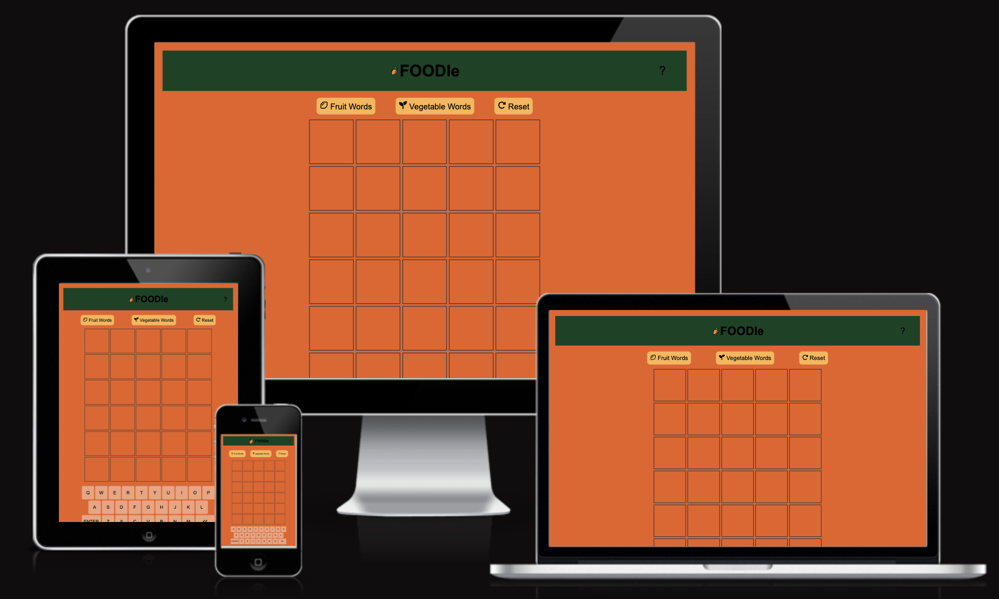

<h1 align="center">FOODle</h1>

[View the live project here](https://yamesjamess.github.io/p2-project-foodle/)

## Table of contents
* [User Experience (UX)](#user-experience-ux)
* [Features](#features)
* [Design](#design)
* [Technologies Used](#technologies-used)
* [Testing](#testing)
* [Deployment](#deployment)
* [Credits](#credits)

## User Experience (UX)

* #### A. First Time Visitor
    

* #### B. Returning Visitor
   

## Features

### Existing Features

* **1 - Placeholder**

* **2 - Placeholder**
    
* **3 - Placeholder**
   
* **4 - Placeholder**
    
* **5 - Placeholder**

* **6 - Gallery**

### Future Features

* **1 - Placeholder**

## Design

### Imagery

### Colour Scheme

    

### Typography

### Wireframe

* Wireframes were created via Balsamiq

    * #### Index Page Wireframe

## Technologies Used

### Languages Used
* [HTML5](https://en.wikipedia.org/wiki/HTML5)
* [CSS3](https://en.wikipedia.org/wiki/CSS)
* [JavaScript](https://en.wikipedia.org/wiki/JavaScript)

### Frameworks, Libraries & Other Tools Used
*   [Balsamiq:](https://balsamiq.com/) was also used to create wireframes during the initial design process.
*   [Coolors:](https://coolors.co/) was used to help generate alternative colours than the colour provided by the client for accessibility.
*   [Favicon.io:](https://favicon.io/) was used to generate a Favicon (a website icon that appears in the tab of the browser or when the website is saved to the bookmark bar) for the website.
*   [Font Awesome:](https://fontawesome.com/) was used to add icons to convey the message of the sections and for aesthetic purposes of the UX
*   [FreeConvert:](https://www.freeconvert.com/jpg-to-webp/) was used to convert .JPG files to .WEBP file.
*   [Git:](https://git-scm.com/) was used for version controlling purposes through git commands via the terminal on GitPod and is pushed to GitHub for cloud-based storage.
*   [GitHub:](https://github.com/) is used to host the repository of the project and is also used for deployment of the website.

## Testing

### Validator Testing

* W3C HTML Validator
    
    *   result for index.html

        

    * Full validation results are available on GitHub here:

        * <a href="https://github.com/yamesjamess/p1-sotofox-designer/blob/main/documentation/validation-results/html-validation-results-index.pdf" target="_blank">HTML Validation Results - Index </a>

* Jigsaw CSS Validator

    * result for style.css
    

    * Full validation results are available on GitHub here:

        * <a href="https://github.com/yamesjamess/p1-sotofox-designer/blob/main/documentation/validation-results/css-validation-results.pdf" target="_blank">CSS Validation Results - style.css</a>

* JSHint JS Validator

    * result for script.js
    

    * Full validation results are available on GitHub here:

        * <a href="https://github.com/yamesjamess/p1-sotofox-designer/blob/main/documentation/validation-results/css-validation-results.pdf" target="_blank">JS Validation Results - script.js</a>

* Lighthouse Accessibility Validator

    *   result for index.html

        

    *   result for index.html (mobile)

          

### Browser Compatibility

*   The website has been tested on these following broswes:
    * Google Chrome Version 110.0.5481.178 (Official Build) (64-bit)
    * Mozilla Firefox Version 110.0.1 (64-bit)
    * Microsoft Edge Version 110.0.1587.57 (Official build) (64-bit)
    * Apple Safari on macOS Ventura Version 16.3 (18614.4.6.1.6)
    * Apple Safari on iOS 16.0 (20A362)
    * DuckDuckGo Mobile Version 7.72.2.0

### Accessibility

* [WebAIM - Contrast Checker:](https://webaim.org/resources/contrastchecker/) was utilised during the design process to determine if the colour scheme would work in terms of readability and accessibility. 
    * Since the colour scheme was selected by the client in order to represent their business, there was some issues with readability and accessibility.
    * The colour #F4D455 was too light, so a darker shade #FFB30F was chosen instead.
    * To make the text more readable, the colour #FFFFFF and #4D4D4D was used when appropriate. 

* [Am I Responsive:](https://ui.dev/amiresponsive) was utilised to check if the website is responsive across different viewports.

* [Chrome DevTools:](https://developer.chrome.com/docs/devtools/) was also utilised to check if the website is responsive across different viewports.

### Test Case and Results

* The table below has listed all the test cases and details of how the test was performed, and the result of the test.

    

### Known Bugs

## Deployment

### How the website was deployed

* This website is deployed via GitHub Pages
    * From the GitHub Repository, navigate to the Settings tab, and select Pages from the menu on the left.
    * From there under the Branch section, select the Main branch and /root directory, and save your selection.
    * Once saved, GitHub will take a couple of minutes to host the website on their GitHub Pages service.
    * Once finished, the link to the deployed website will appear on the page.
    * Any commits pushed from the main branch of the repository will be updated to the live website by GitHub automatically.

    The live website can be found here [Sotofox Home Designer & Artist](https://yamesjamess.github.io/p2-project-foodle/)

### How to copy this repository

* Visit the main repository at https://github.com/yamesjamess/p2-project-foodle.
* Click the "Code" button to the right of the screen, click HTTPs and copy the link present there.
* Open a GitBash terminal and navigate to the directory where you want to clone.
* In the terminal, type "git clone" then paste in the copied URL and press the Enter key to begin the cloning process.

### How to fork this repository

* Visit the main repository at https://github.com/yamesjamess/p2-project-foodle.
* On the top right hand corner click on the "Fork" button.
* You will be redirected to a new page, from there enter the name you desire the name the forked repository and click "Create Fork"
* You will now have a Fork copy of the repository on your own repository.

## Credits

### Content

* 
* All other content was written by the developer.

### Code

* 

### Media

* 

### Acknowledgements

* Thank you for my mentor, Brian Macharia, for helping me with troubleshooting responsive designs of the overall page and the gallery. Also, for all the feedback and plannng process that you provided during our mentoring sessions.
