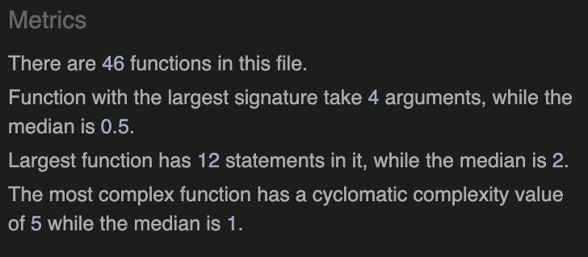

<h1 align="center">FOODle</h1>

[View the live project here](https://yamesjamess.github.io/p2-project-foodle/)

## Table of contents
* [User Experience (UX)](#user-experience-ux)
* [Features](#features)
* [Design](#design)
* [Technologies Used](#technologies-used)
* [Testing](#testing)
* [Deployment](#deployment)
* [Credits](#credits)

## User Experience (UX)

* #### A. First Time Visitor
    1. As a First Time Visitor, I want to understand what this website is about and how to interact with it.
    2.  As a First Time Visitor, I want to learn how to play the game.
    3.  As a First Time Visitor, I want to know how to win the game.
     As a First Time Visitor, I want to know what I have to do if I lose the game.

* #### B. Returning Visitor
    1. As a Returning Visitor, I want to easily navigate the website.
    2. As a Returning Visitor, I want to be able to play the game over and over again.
    3. As a Returning Visitor, I want to know my scores.

## Features

### Existing Features

* **1 - Landing Screen**
    

    * The landing screen features a background image with the title of the game, an input box for the user to input a username, and a start button
    * The image was chosen because the theme of the game is a food theme word guessing game and the colour scheme of the website is chosen to mimic the colour of a carrot. 
* **2 - How to Play Window**
    
    
    * The How to Play is a modal window that the user can make it display or hide with a simple click
    
* **3 - Theme Selectors**
    

    * The Theme Selectors button lets the user select which themed words they want to play.
    * The user is prompted with an alert message and also the button is highlighted to give a visual cue as to which theme they have chosen.
   
* **4 - Game Area & Keyboard**
    

    * The game area is the main area where the user will input their guess after selecting a theme. 
    * The colouring of each letter tiles acts as a hint to the user if they got the letter correctly and in the correct position or not
    * User can input their guess either via the keyboard on their device or by clicking on the on-screen keyboard.
    * The letters on the keys also change according to the colouring of the tiles.
    
* **5 - Alert Box**
    
    * The alert box helps the user understand what they need to do for the game to function properly.
    * There are alerts for
        * When the user hasn't selected a theme.
        * When the user didn't input enough letters.
        * When the user inputs an invalid word.
        * When the user lost the game.
        * When the user won the game.

* **6 - Tile Animation**

    * There are two different animations for the tiles in the game

    1. Flip Tiles Animation
    

    * The Flip Tile animation is run when the user entered a valid word as a guess. The game validates the word against the answer and gives each title a class, which colours each tile accordingly.

    2. Dance Tiles Animation
    

    * The Dance Title animation is only executed when the user submitted the correct word.
    * This gives the user a visual cue that looks like the tiles are celebrating the user's victory!

### Future Features

* **1 - Sound effects**

    * I would like to add some sound effects when the user submits their guess and the tile flips.

* **2 - Scoreboard**
    * I would like to add a scoreboard based on how many guesses it took for the user to guess the correct word.

* **3 - Expanded targetWords list**
    * I would like to add more words to the targetWords variable, and possibly more themes

* **4 - Double letters allowed**
    * I would like to add a logic where the game validates words with double letters to determine if the answer has double letters or not. The game in the current version will highlight the double letter as correct letter & correct location or correct letter & incorrect location even if there is only one of that letter in the answer.

## Design
* Since this game is heavily inspired by the world renowned game Wordle. I want to keep it as similar to the original game as possible for ease of recognition. However, to make this game more unique, I decided to approach a themed version of Wordle. Choosing the theme of Food helped me with my decision for both functionality and visuals.

### Colour Scheme

* The colour scheme that was chosen for this website is based on a carrot. Since the game is a food word guessing game, I thought it would be a great idea to make the colour scheme of the game reflect that. I think orange and green is a very neutral colour and doesn't feel overly strong and harsh like red or purple.
* The rest of the colours are chosen based on their contrast against the main colour scheme, also some of the colours chosen have a food-related name.

* Main Colour Scheme
    * #0E4323 - British Racing Green
    * #EA5F1F - Persimmon
    * #E6C328 - Saffron
    * #DEB887 - Tan

* Keys Colour Scheme
    * #3A9246 - Forest Green
    * #D57244 - Brunt Sienna
    * #E6C328 - Saffron

### Typography

* The font used in this game is Helvetica Neue. This is the font that is used in the official Wordle game. The font is clean, neutral, and modern.

### Wireframe

* Wireframes were created via Balsamiq

    * #### Desktop Wireframe

    

    * #### Mobile Wireframe

    

## Technologies Used

### Languages Used
* [HTML5](https://en.wikipedia.org/wiki/HTML5)
* [CSS3](https://en.wikipedia.org/wiki/CSS)
* [JavaScript](https://en.wikipedia.org/wiki/JavaScript)
    * Note: This is a JavaScript project, however on GitHub, the percentage of HTML is higher than JavaScript due to the SVG image that has been added to the HTML file.
### Frameworks, Libraries & Other Tools Used
*   [Balsamiq:](https://balsamiq.com/) was also used to create wireframes during the initial design process.
*   [Coolors:](https://coolors.co/) was used to help generate colour for the website
*   [Favicon.io:](https://favicon.io/) was used to generate a Favicon (a website icon that appears in the tab of the browser or when the website is saved to the bookmark bar) for the website.
*   [Font Awesome:](https://fontawesome.com/) was used to add icons to convey the message of the sections and for aesthetic purposes of the UX.
*   [FreeConvert:](https://www.freeconvert.com/) was used to convert image files to .WEBP file.
*   [Git:](https://git-scm.com/) was used for version controlling purposes through git commands via the terminal on GitPod and is pushed to GitHub for cloud-based storage.
*   [GitHub:](https://github.com/) is used to host the repository of the project and is also used for the deployment of the website.

## Testing

### Validator Testing

* W3C HTML Validator
    
    *   result for index.html

        

* Jigsaw CSS Validator

    * result for style.css
    

* JSHint JS Validator

    * result for script.js
    

* Lighthouse Accessibility Validator

    *   result for index.html

        

    *   result for index.html (mobile)

         
        
* WAVE Accessibility Evaluation Tool

    * result for the index.html
        * Summary
        
        * Alerts
        
        * Features
        
        * Structure
        

### Browser Compatibility

*   The website has been tested on the following browsers:
    * Google Chrome Version 112.0.5615.137 (Official Build) (arm64)
    * Mozilla Firefox Version 112.0.2 (64-bit)
    * Microsoft Edge Version 112.0.1722.64 (Official Build) (64-bit)
    * Apple Safari on macOS Ventura Version 16.3 (18614.4.6.1.6)
    * Apple Safari on iOS 16..4.1 (20A362)
    * DuckDuckGo Mobile Version 7.72.11.0

### Accessibility

* [WebAIM - Contrast Checker:](https://webaim.org/resources/contrastchecker/) was utilised during the design process to determine if the colour scheme would work in terms of readability and accessibility. 

* [WebAIM - WAVE:](https://wave.webaim.org/) was also utilised to check the website as a whole for acessibility issues.

* [Am I Responsive:](https://ui.dev/amiresponsive) was utilised to check if the website is responsive across different viewports.

* [Chrome DevTools:](https://developer.chrome.com/docs/devtools/) was also utilised to check if the website is responsive across different viewports.

### Test Case and Results

* The table below has listed all the test cases and details of how the test was performed, and the result of the test.

    

### Known Bugs

* User cannot use the Return key to submit their username on the starting page
    * Fixed by adding an event listener to the input to listen when the user press the Return key.
* The game tiles are overlapping the keyboard, and on some devices, the game tiles are too small and leave large empty spaces on the site.
    * Fixed by adjusting the relative sizing value of the game tiles and also adjusting the flex box.

## Deployment

### How the website was deployed

* This website is deployed via GitHub Pages
    * From the GitHub Repository, navigate to the Settings tab, and select Pages from the menu on the left.
    * From there under the Branch section, select the Main branch and /root directory, and save your selection.
    * Once saved, GitHub will take a couple of minutes to host the website on their GitHub Pages service.
    * Once finished, the link to the deployed website will appear on the page.
    * Any commits pushed from the main branch of the repository will be updated to the live website by GitHub automatically.

    The live website can be found here [FOODle](https://yamesjamess.github.io/p2-project-foodle/)

### How to copy this repository

* Visit the main repository at https://github.com/yamesjamess/p2-project-foodle.
* Click the "Code" button to the right of the screen, click HTTPs and copy the link present there.
* Open a GitBash terminal and navigate to the directory where you want to clone.
* In the terminal, type "git clone" then paste in the copied URL and press the Enter key to begin the cloning process.

### How to fork this repository

* Visit the main repository at https://github.com/yamesjamess/p2-project-foodle.
* On the top right-hand corner click on the "Fork" button.
* You will be redirected to a new page, from there enter the name you desire the name the forked repository and click "Create Fork"
* You will now have a Fork copy of the repository on your repository.

## Credits

### Content

* Game inspired by [Wordle](https://www.nytimes.com/games/wordle/index.html)
* All other content was written by the developer.

### Code

* The main game JavaScript Logic - [Web Dev Simplified](https://www.youtube.com/watch?v=Wak7iN4JZzU)

* Tutorial on building a modal for the How To Play window - [Web Dev Simplified](https://www.youtube.com/watch?v=MBaw_6cPmAw)

* [StackOverflow thread](https://stackoverflow.com/questions/9707021/how-do-i-auto-hide-placeholder-text-upon-focus-using-css-or-jquery) on hiding placeholder in the input on focus - [Rob Fletcher](https://stackoverflow.com/users/565049/rob-fletcher)

* Fetch Method was learned from [MDN](https://developer.mozilla.org/en-US/docs/Web/API/Fetch_API/Using_Fetch) and [Web Dev Simplified](https://www.youtube.com/watch?v=cuEtnrL9-H0)

### Media

* Starting Page Image - [Gabriel Gurrola](https://unsplash.com/photos/fcgPRZmTM5w) from Unsplash

* Carrot Icon - [Sofia Moya](https://www.svgrepo.com/svg/489694/carrot) from SVG Repo

### Acknowledgements

* Thank you for my mentor, Brian Macharia, for helping me with coming up with ideas for what functionality I should add to customise the application.
* Special thanks to the wonderful Code Institute Tutors; Joshua, Joane, and Ed, for helping me debug my code and modify the logic of the game.
* Special thanks to [Marram](https://stackoverflow.com/users/21666265/marram) from [StackOverflow](https://stackoverflow.com/questions/76105938/css-background-image-not-showing-up-in-my-deployed-site/76105952#76105952) with debugging the background image not showin up.
* Special thanks to fellow Code Institute students John Dickson and Stephen Dawson for feedback on the Peer Code Review.
